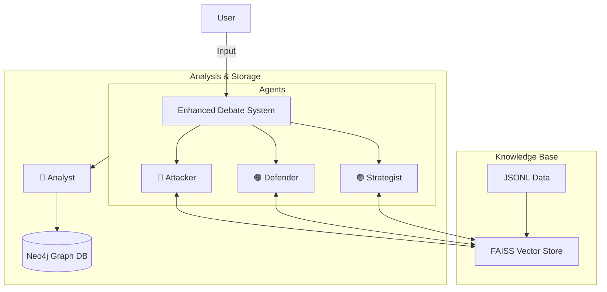

# 🧠 Project Sun Tzu - Knowledge Graph

3D Cosmic Knowledge Graph Visualization + AI Debate System สำหรับวิเคราะห์และสร้างความรู้ใหม่จากหนังสือต่างๆ

  

## ✨ Features

- 🌌 **3D Neural Network Visualization** - กราฟ 3 มิติ WebGL พร้อม glow effects (60 FPS)
- ⚡ **Synapse Particles** - อนุภาควิ่งตามเส้นเชื่อมเหมือนกระแสประสาท
- 🤖 **Multi-Agent Debate System** - 4 AI Agents ทำงานร่วมกันเพื่อสร้าง Insights
- 🧠 **Analytic INFJ Strategist** - Agent เชิงกลยุทธ์ที่จำลองกระบวนการคิดของผู้สร้าง
- 📚 **RAG Knowledge Base** - ค้นหาข้อมูลจากหนังสือ 120+ เล่มด้วย Vector Search
- 🔍 **Interactive Graph** - ค้นหา nodes และซูมไปยังตำแหน่ง
- 💾 **Auto Backup** - ระบบ Backup/Restore ฐานข้อมูล
- 🔊 **Text-to-Speech (TTS)** - ฟังเสียง AI โต้วาทีแบบ Multi-Voice (edge-tts)

👉 **[อ่านเอกสารโครงสร้างระบบฉบับเต็ม (System Architecture)](docs/SYSTEM_ARCHITECTURE.md)**

---

## 🏗️ System Architecture



---

## 🚀 Quick Start

### Prerequisites

- **Node.js** 18+
- **Python** 3.12+
- **Java** 17+ (สำหรับ Neo4j)

### 1. Clone & Install

```bash
git clone https://github.com/Mike0165115321/knowledge-graph.git
cd knowledge-graph

# Frontend
npm install

# Backend
cd backend
python -m venv venv
source venv/bin/activate  # Linux/Mac
pip install -r requirements.txt
```

### 2. Setup Environment

สร้างไฟล์ `backend/.env`:

```env
GOOGLE_API_KEYS=your_gemini_api_key_1,your_gemini_api_key_2
NEO4J_URI=bolt://localhost:7688
NEO4J_USERNAME=neo4j
NEO4J_PASSWORD=password
```

### 3. Install Neo4j (First Time Only)

```bash
mkdir -p neo4j-local && cd neo4j-local
wget https://neo4j.com/artifact.php?name=neo4j-community-5.26.0-unix.tar.gz -O neo4j.tar.gz
tar -xzf neo4j.tar.gz && rm neo4j.tar.gz
cd neo4j-community-5.26.0
./bin/neo4j-admin dbms set-initial-password password
```

---

## 📜 Usage (Single Script)

```bash
./run.sh [command]
```

| Command | Description |
|---------|-------------|
| `./run.sh frontend` | 🌐 รัน Frontend ดูกราฟ 3D (port 3000) |
| `./run.sh debate` | 🎭 รัน AI Debate สร้างข้อมูล (port 8501) |
| `./run.sh db` | 🗃️ เปิด Neo4j Browser (port 7475) |
| `./run.sh backup` | 💾 สร้าง Backup ฐานข้อมูล |
| `./run.sh restore` | 🔄 กู้คืนจาก Backup ล่าสุด |
| `./run.sh help` | 📖 แสดงวิธีใช้ |

---

## 🌐 URLs

| Service | URL |
|---------|-----|
| **Frontend (Graph 3D)** | http://localhost:3000 |
| **Debate UI (Streamlit)** | http://localhost:8501 |
| **Backend API** | http://localhost:8000 |
| **Neo4j Browser** | http://localhost:7475 |

---

## 📁 Project Structure

```
project-sun-tzu/
├── backend/                  # Core Application Logic (Python)
│   ├── app/
│   │   ├── agents/           # AI Agents (Attacker, Defender, Strategist, Analyst)
│   │   ├── rag/              # Vector Search (Embedding Based)
│   │   ├── core/             # Config, Neo4j client
│   │   └── debate_ui.py      # Streamlit Debate UI
│   ├── data/                 # Raw Book Data (JSONL)
│   └── .env                  # API Keys & Secrets
├── frontend/                 # Frontend (Next.js)
│   └── src/components/GraphViz/ # 3D Graph Components
├── neo4j-local/              # Neo4j Database
├── docs/                     # Documentation
└── run.sh                    # Master control script
```

---

## 🤖 AI Agents

| Agent | ชื่อ | Role | Detail |
|-------|------|------|--------|
| 🔴 **Time** (ทาม) | Attacker | ผู้โจมตี | วิเคราะห์เทคนิคเชิงรุก หาจุดอ่อน และช่องว่าง |
| 🟢 **Ann** (แอน) | Defender | ผู้ป้องกัน | วิเคราะห์ความเสี่ยง หาทางแก้ และสร้างเกราะคุ้มกัน |
| 🟣 **Mike** (ไมค์) | Strategist | นักกลยุทธ์ | Analytic INFJ Persona วิเคราะห์ Game State และ Framing |
| 🔵 **Analyst** | - | ผู้วิเคราะห์ | สกัด Knowledge Graph (Nodes/Edges) จากบทสนทนา |

---

## 🎮 Controls

| Action | Description |
|--------|-------------|
| **ลากเมาส์** | หมุนกราฟ 3D |
| **Scroll** | ซูมเข้า/ออก |
| **คลิก Node** | ดูรายละเอียด + ซูมไปที่ node |

---

## 🛠️ Tech Stack

- **Frontend:** Next.js 16, React, react-force-graph-3d, Three.js
- **Backend:** Python 3.12, LangChain, Streamlit, FAISS (Vector DB)
- **Database:** Neo4j (Native Installation)
- **AI:** Google Gemini 2.5 Flash
- **TTS:** Edge-TTS (Microsoft Azure Neural Voices)

---

## 📄 License

MIT License

---

## 👤 Author

Mike - [@Mike0165115321](https://github.com/Mike0165115321)
