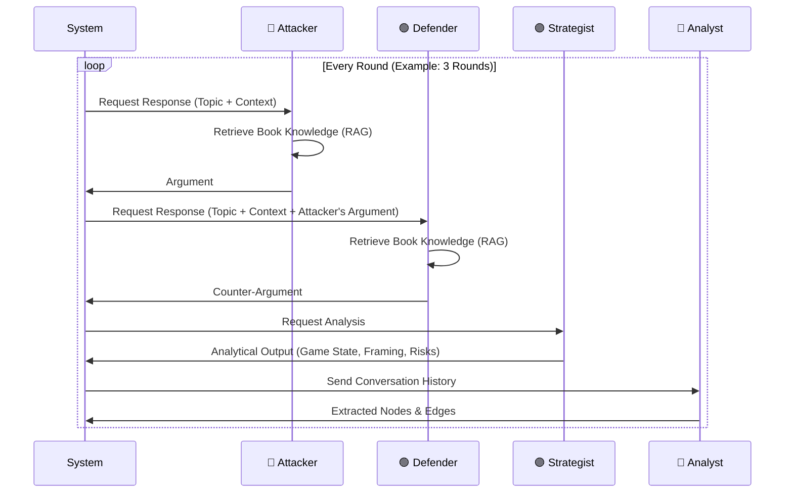

# System Architecture Documentation

## 📂 Project Structure

```
project-sun-tzu/
├── backend/                  # Core Application Logic (Python)
│   ├── app/
│   │   ├── agents/           # AI Agents Definition
│   │   │   ├── enhanced_debate.py # Main Debate System (Attacker, Defender, Strategist)
│   │   │   └── analyst_agent.py   # Analyst Agent (Graph Extraction)
│   │   ├── core/             # Core Utilities
│   │   │   ├── config.py     # Configuration & API Keys
│   │   │   ├── schemas.py    # Pydantic Models (Nodes, Edges)
│   │   │   └── neo4j_client.py # Database Interface
│   │   ├── rag/              # Retrieval Augmented Generation
│   │   │   └── embedding_rag.py   # Vector Search (FAISS + Sentence Transformers)
│   │   └── debate_ui.py      # Streamlit UI
│   ├── data/                 # Raw Book Data (JSONL)
│   ├── scripts/              # Helper Scripts (Ingestion, Setup)
│   └── .env                  # API Keys & Secrets
├── frontend/                 # Frontend (Next.js - *Currently Secondary to Streamlit UI*)
├── neo4j-local/              # Neo4j Database (Docker/Binaries)
└── docs/                     # Documentation
```

---

## 🏗️ System Architecture

ระบบ AI Debate นี้ออกแบบด้วยสถาปัตยกรรม **Multi-Agent System** ผสานกับ **RAG (Retrieval Augmented Generation)** และ **Knowledge Graph**

```mermaid
graph TD
    User[User / UI] -->|Input Topic| Orchestrator[EnhancedDebateSystem]
    
    subgraph "Knowledge Core"
        Books[Book Data (JSONL)] -->|Ingest| VectorDB[FAISS Vector Store]
        Model[Embedding Model<br/>e5-large] -.->|Encode| VectorDB
    end
    
    subgraph "Debate Arena"
        Orchestrator -->|Turn 1| Attacker[🔴 Attacker Agent]
        Orchestrator -->|Turn 2| Defender[🟢 Defender Agent]
        Orchestrator -->|Turn 3| Strategist[🟣 Strategist Agent]
        
        Attacker <-->|Query Query| VectorDB
        Defender <-->|Query Context| VectorDB
        Strategist <-->|Analyze Game| VectorDB
    end
    
    subgraph "Analysis Engine"
        DebateStream[Conversation Stream] --> Analyst[🔵 Analyst Agent]
        Analyst -->|Extract| Nodes[Nodes]
        Analyst -->|Extract| Edges[Edges]
        Nodes & Edges --> DB[(Neo4j Graph DB)]
    end
    
    Attacker & Defender & Strategist --> DebateStream
```

---

## 🧠 Core Algorithms

### 1. Multi-Agent Debate Loop (`enhanced_debate.py`)

อัลกอริทึมหลักในการดำเนิน Debate ระหว่าง Agents 3 ตัว:



### 2. Implementation: Strategist Agent

Agent ใหม่ที่ใช้ System Prompt แบบ **Analytic INFJ** เพื่อวิเคราะห์เกมเชิงกลยุทธ์:

1. **Input:** ประวัติบทสนทนา (Debate History) และ Attacker's Argument
2. **Process:**
   - **Game State Analysis:** ใครคุมเกม? บรรยากาศเป็นอย่างไร?
   - **Framing Detection:** ฝ่ายตรงข้ามใช้กรอบความคิดอะไร? เจตนาแฝงคืออะไร?
   - **Causal Projection:** ผลกระทบระยะยาว (Second-order effects) ความเสี่ยง
3. **Output:** 5 Sections (Game State, Framing, Advantage, Risk, Implication)
4. **Integration:** ทำงานเป็น Observer/Moderator ที่ไม่เข้าข้างฝ่ายใด แต่ชี้ให้เห็นโครงสร้างอำนาจ

### 3. Retrieval Augmented Generation (RAG)

ใช้ **Semantic Search** เพื่อดึงเนื้อหาจากหนังสือ 120 เล่ม:
- **Embedding Model:** `intfloat/multilingual-e5-large` (1024 dimensions)
- **Vector Store:** `FAISS` (Facebook AI Similarity Search) - ใช้ Index แบบ Inner Product (Cosine Similarity)
- **Process:**
    1. แปลง Query เป็น Vector
    2. ค้นหา Top-K (เช่น 3-5) chunks ที่ใกล้เคียงสุด
    3. ส่ง Context ให้ Agents ใช้ประกอบการถกเถียง

### 4. Knowledge Graph Extraction

Analyst Agent แปลงข้อความ (Unstructured) เป็นกราฟ (Structured):
- **Nodes:** Concept, Strategy, Person, Book
- **Edges:** RELATES_TO, ATTACKS, SUPPORTS, DERIVED_FROM
- **Deduplication:** ตรวจสอบ Nodes ซ้ำใน Neo4j ก่อนสร้างใหม่

---

## 💾 Data Flow

1. **Ingestion:** Text Files → JSONL → Embeddings → FAISS Index
2. **Runtime:** 
   - User Input → Agents (Attacker/Defender/Strategist)
   - Agent Responses → Conversation History (Memory)
   - Conversation → Analyst → Nodes/Edges
   - Nodes/Edges → Neo4j (Persistence)
