# System Architecture Documentation

## 📂 Project Structure

```
project-sun-tzu/
├── backend/                  # Core Application Logic (Python)
│   ├── app/
│   │   ├── agents/           # AI Agents Definition
│   │   │   ├── enhanced_debate.py # Main Debate System (Attacker, Defender, Strategist)
│   │   │   └── analyst_agent.py   # Analyst Agent (Graph Extraction)
│   │   ├── core/             # Core Utilities
│   │   │   ├── config.py     # Configuration & API Keys
│   │   │   ├── schemas.py    # Pydantic Models (Nodes, Edges)
│   │   │   ├── neo4j_client.py # Database Interface
│   │   │   └── tts.py        # Text-to-Speech Engine (edge-tts)
│   │   ├── rag/              # Retrieval Augmented Generation
│   │   │   └── embedding_rag.py   # Vector Search (FAISS + Sentence Transformers)
│   │   └── debate_ui.py      # Streamlit UI
│   ├── data/                 # Raw Book Data (JSONL)
│   ├── scripts/              # Helper Scripts (Ingestion, Setup)
│   └── .env                  # API Keys & Secrets
├── frontend/                 # Frontend (Next.js - *Currently Secondary to Streamlit UI*)
├── neo4j-local/              # Neo4j Database (Docker/Binaries)
└── docs/                     # Documentation
```

---

## 🏗️ System Architecture

ระบบ AI Debate นี้ออกแบบด้วยสถาปัตยกรรม **Multi-Agent System** ผสานกับ **RAG (Retrieval Augmented Generation)** และ **Knowledge Graph**

```mermaid
graph TD
    %% Nodes
    User(["👤 User / UI"])
    
    subgraph Core ["🧠 Enhanced Debate Orchestrator"]
        System[["⚙️ Debate Controller"]]
    end
    
    subgraph Knowledge ["📚 Knowledge Base"]
        Books[("📖 Book Data (JSONL)")]
        VectorDB[("🧩 FAISS Vector DB")]
    end
    
    subgraph Agents ["🤖 AI Agents Arena"]
        Attacker{{"🔴 Attacker<br/>(Aggressive)"}}
        Defender{{"🟢 Defender<br/>(Protective)"}}
        Strategist{{"🟣 Strategist<br/>(Analytic INFJ)"}}
    end
    
    subgraph Analysis ["📊 Analysis Engine"]
        Analyst["🔵 Analyst<br/>(Graph Extractor)"]
        Neo4j[("🗄️ Neo4j<br/>(Knowledge Graph)")]
    end
    
    %% Connections
    User ==>|1. Topic| System
    
    Books -->|Ingest| VectorDB
    VectorDB -.->|Context| Agents
    
    System ==>|2. Turn 1| Attacker
    System ==>|3. Turn 2| Defender
    System ==>|4. Turn 3| Strategist
    
    Agents ==>|5. Debate Content| System
    System ==>|6. History| Analyst
    Analyst ==>|7. Nodes & Edges| Neo4j
    
    %% Styling
    classDef user fill:#2d3748,stroke:#fff,color:#fff
    classDef core fill:#4a5568,stroke:#a0aec0,color:#fff
    classDef kb fill:#2c5282,stroke:#63b3ed,color:#fff
    classDef attack fill:#742a2a,stroke:#fc8181,color:#fff
    classDef defend fill:#22543d,stroke:#68d391,color:#fff
    classDef strategy fill:#553c9a,stroke:#9f7aea,color:#fff
    classDef analysis fill:#2b6cb0,stroke:#63b3ed,color:#fff
    classDef db fill:#000000,stroke:#4fd1c5,color:#fff

    class User user
    class System core
    class Books,VectorDB kb
    class Attacker attack
    class Defender defend
    class Strategist strategy
    class Analyst analysis
    class Neo4j db
```



---

## 🧠 Core Algorithms

### 1. Multi-Agent Debate Loop (`enhanced_debate.py`)

อัลกอริทึมหลักในการดำเนิน Debate ระหว่าง Agents 3 ตัว:

```mermaid
sequenceDiagram
    participant System
    participant Attacker as 🔴 Attacker
    participant Defender as 🟢 Defender
    participant Strategist as 🟣 Strategist
    participant Analyst as 🔵 Analyst

    loop Every Round (Example: 3 Rounds)
        System->>Attacker: Request Response (Topic + Context)
        Attacker->>Attacker: Retrieve Book Knowledge (RAG)
        Attacker->>System: Argument
        
        System->>Defender: Request Response (Topic + Context + Attacker's Argument)
        Defender->>Defender: Retrieve Book Knowledge (RAG)
        Defender->>System: Counter-Argument
        
        System->>Strategist: Request Analysis
        Strategist->>System: Analytical Output (Game State, Framing, Risks)
        
        System->>Analyst: Send Conversation History
        Analyst->>System: Extracted Nodes & Edges
    end
```



### 2. Implementation: Strategist Agent

Agent ใหม่ที่ใช้ System Prompt แบบ **Analytic INFJ** เพื่อวิเคราะห์เกมเชิงกลยุทธ์:

1. **Input:** ประวัติบทสนทนา (Debate History) และ Attacker's Argument
2. **Process:**
   - **Game State Analysis:** ใครคุมเกม? บรรยากาศเป็นอย่างไร?
   - **Framing Detection:** ฝ่ายตรงข้ามใช้กรอบความคิดอะไร? เจตนาแฝงคืออะไร?
   - **Causal Projection:** ผลกระทบระยะยาว (Second-order effects) ความเสี่ยง
3. **Output:** 5 Sections (Game State, Framing, Advantage, Risk, Implication)
4. **Integration:** ทำงานเป็น Observer/Moderator ที่ไม่เข้าข้างฝ่ายใด แต่ชี้ให้เห็นโครงสร้างอำนาจ

### 3. Retrieval Augmented Generation (RAG)

ใช้ **Semantic Search** เพื่อดึงเนื้อหาจากหนังสือ 120 เล่ม:
- **Embedding Model:** `intfloat/multilingual-e5-large` (1024 dimensions)
- **Vector Store:** `FAISS` (Facebook AI Similarity Search) - ใช้ Index แบบ Inner Product (Cosine Similarity)
- **Process:**
    1. แปลง Query เป็น Vector
    2. ค้นหา Top-K (เช่น 3-5) chunks ที่ใกล้เคียงสุด
    3. ส่ง Context ให้ Agents ใช้ประกอบการถกเถียง

### 4. Knowledge Graph Extraction

Analyst Agent แปลงข้อความ (Unstructured) เป็นกราฟ (Structured):
- **Nodes:** Concept, Strategy, Person, Book
- **Edges:** RELATES_TO, ATTACKS, SUPPORTS, DERIVED_FROM
- **Deduplication:** ตรวจสอบ Nodes ซ้ำใน Neo4j ก่อนสร้างใหม่

---

## 💾 Data Flow

1. **Ingestion:** Text Files → JSONL → Embeddings → FAISS Index
2. **Runtime:** 
   - User Input → Agents (Attacker/Defender/Strategist)
   - Agent Responses → Conversation History (Memory)
   - Conversation → Analyst → Nodes/Edges
   - Nodes/Edges → Neo4j (Persistence)
3. **TTS Output:**
   - Agent Response → edge-tts → MP3 Audio
   - Audio → Browser Playback (JavaScript Queue)

---

## 🔊 Text-to-Speech (TTS) System

ระบบเสียงสังเคราะห์เพื่อฟัง AI โต้วาที:

- **Engine:** `edge-tts` (Microsoft Azure Neural Voices)
- **Voices:** 
  - 🔴 Attacker: `th-TH-NiwatNeural` (Pitch: -5Hz)
  - 🟢 Defender: `th-TH-PremwadeeNeural` (Default)
  - 🟣 Strategist: `th-TH-NiwatNeural` (Pitch: +10Hz)
- **Features:**
  - Auto-play mode (toggle in sidebar)
  - "Play All" button with JavaScript queue (no overlap)
  - Per-message TTS with agent-specific voices
- **Duration Calculation:** `mutagen` library reads MP3 metadata for accurate timing
